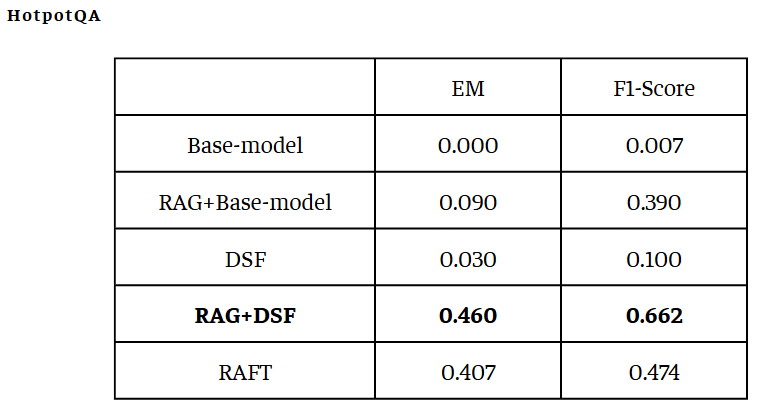
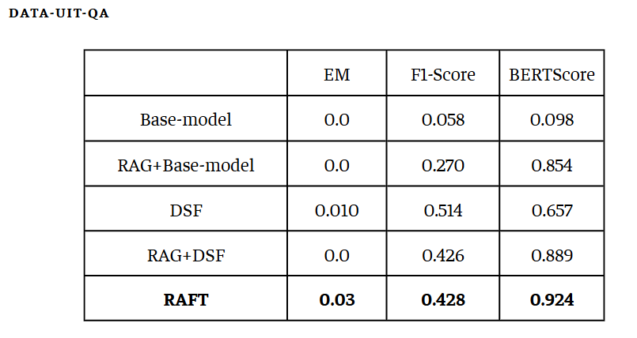

# Giới thiệu
Đây là đồ án môn học thuộc môn học CS431 - Các kỹ thuật học sâu và ứng dụng, trường Đại học Công nghệ Thông tin - DHQGHCM.

Mục tiêu: 
- Re-produce kết quả của bài báo "RAFT: Adapting Language Model to Domain Specific RAG" (file pdf bài báo được đính kèm trong repo).
- Thực nghiệm 5 phương pháp huấn luyện khác nhau trên hai bộ dataset Hotpot_QA và UIT_QA, bao gồm: base model, base model + RAG, DFS, DFS + RAG và RAFT.

Kết quả: 

Chi tiết đồ án được ghi trong file doc đính kèm